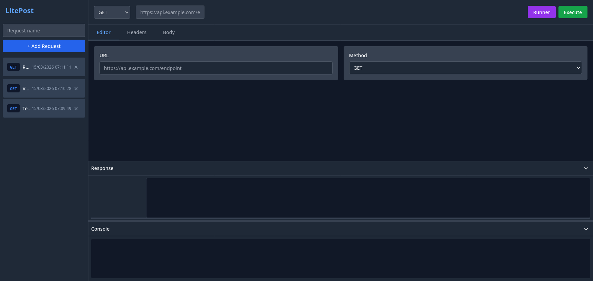
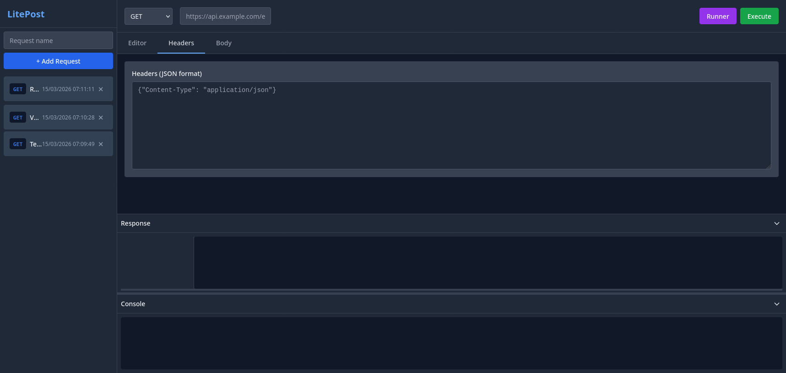
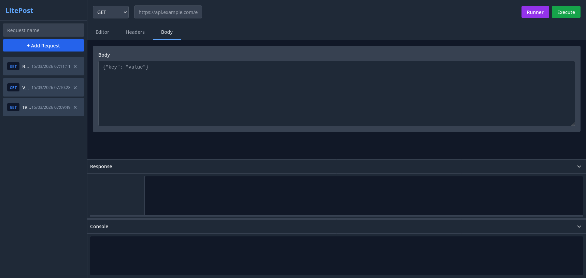

# 🚀 LitePost

<div align="center">

**LitePost** - A lightweight, self-hosted API client built with ❤️ by the community.

[](https://nodejs.org/)
[](https://expressjs.com/)
[](https://www.sqlite.org/)
[](https://opensource.org/licenses/MIT)

</div>

A modern, intuitive API client that brings the power of Postman to your fingertips. Built with **Node.js**, **Express**, and **SQLite**, LitePost makes it easy to create, manage, and execute HTTP requests with a beautiful dark-themed interface.

---

## ✨ Features

### 🎯 Core Functionality

- **💾 Save & Manage Requests** - Create, edit, and delete HTTP requests with ease
- **🚀 Server-Side Proxy** - Execute requests via `/api/proxy` endpoint to bypass CORS limitations
- **🔄 Variable Substitution** - Use `{{variable_name}}` syntax in URLs and request bodies for dynamic requests
- **📊 Bulk Run with CSV** - Upload CSV files to iterate through rows and inject values into placeholders
- **🗄️ SQLite Database** - Persistent storage using better-sqlite3 for reliability

### 🎨 User Interface

- **🌙 Dark Theme** - Easy on the eyes with a modern dark interface
- **📱 Responsive Design** - Works seamlessly on desktop and tablet devices
- **⚡ Real-time Response** - View responses instantly with syntax highlighting
- **📝 Console Output** - Debug your requests with detailed console logs

---

## 🛠️ Tech Stack

| Layer | Technology |
|-------|------------|
| **Backend** | Node.js, Express.js |
| **Database** | SQLite (better-sqlite3) |
| **HTTP Client** | Axios |
| **Frontend** | Vanilla JavaScript, Tailwind CSS |
| **CSV Parsing** | csv-parser |
| **File Upload** | Multer |

---

## 📸 Screenshots

### Main Dashboard



### Request Editor


### Headers Panel



### Request Body



---

## 🚀 Installation

```bash
# Clone the repository
git clone https://github.com/yourusername/litepost.git
cd litepost

# Install dependencies
npm install

# Start the server
npm start
```

The server will run on `http://localhost:8081`

---

## 📡 API Endpoints

### Request Management

| Method | Endpoint | Description |
|--------|----------|-------------|
| `GET` | `/api/requests` | List all saved requests |
| `POST` | `/api/requests` | Create a new request |
| `PUT` | `/api/requests/:id` | Update an existing request |
| `DELETE` | `/api/requests/:id` | Delete a request |

### Request Execution

| Method | Endpoint | Description |
|--------|----------|-------------|
| `POST` | `/api/proxy` | Execute a request (bypasses CORS) |
| `POST` | `/api/bulk-run` | Bulk execute with CSV variable injection |

---

## 💻 Usage

### Creating a Request

```bash
curl -X POST http://localhost:8081/api/requests \
  -H "Content-Type: application/json" \
  -d '{
    "name": "Test API",
    "method": "GET",
    "url": "https://jsonplaceholder.typicode.com/posts/1",
    "headers": "Content-Type: application/json",
    "body": "{\"title\":\"test\",\"body\":\"body\",\"userId\":1}"
  }'
```

### Executing a Request via Proxy

```bash
curl -X POST http://localhost:8081/api/proxy \
  -H "Content-Type: application/json" \
  -d '{"requestId": 1}'
```

### Variable Substitution

Create a request with variables:

```json
{
  "name": "Variable Test",
  "method": "GET",
  "url": "https://jsonplaceholder.typicode.com/posts/{{postId}"
}
```

Execute with variables:

```bash
curl -X POST http://localhost:8081/api/proxy \
  -H "Content-Type: application/json" \
  -d '{"requestId": 2, "postId": "1"}'
```

### Bulk Run with CSV

Upload a CSV file to execute requests with variable injection. CSV columns are mapped to `{{col0}}`, `{{col1}}`, etc.

```bash
curl -X POST http://localhost:8081/api/bulk-run \
  -H "Content-Type: application/json" \
  -F "requestId=1" \
  -F "file=@data.csv"
```

---

## 📁 Project Structure

```
litepost/
├── server.js          # Express server with all API endpoints
├── db.js              # Database initialization and schema
├── package.json       # Project dependencies
├── README.md          # Documentation
├── public/
│   ├── index.html     # Frontend UI
│   ├── css/
│   │   └── styles.css # Custom styles
│   └── js/
│       └── app.js     # Frontend JavaScript logic
├── plans/
│   └── litepost-architecture.md
└── data.db            # SQLite database (created on first run)
```

---

## 🎯 Use Cases

- **API Testing** - Test REST APIs quickly and efficiently
- **Documentation** - Save and organize API requests for team reference
- **Automation** - Run bulk requests with CSV data injection
- **Development** - Rapid API prototyping and debugging

---

## 🤝 Contributing

Contributions are welcome! Please feel free to submit a Pull Request.

1. Fork the project
2. Create your feature branch (`git checkout -b feature/AmazingFeature`)
3. Commit your changes (`git commit -m 'Add some AmazingFeature'`)
4. Push to the branch (`git push origin feature/AmazingFeature`)
5. Open a Pull Request

---

## 📝 License

This project is licensed under the MIT License - see the [LICENSE](LICENSE) file for details.

---

## 👥 Authors

Built with passion for API development and testing.

---

<div align="center">

**Made with ❤️ using Node.js, Express, and SQLite**

</div>
