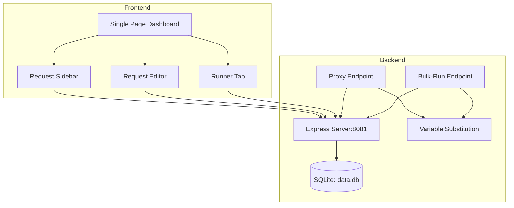

# LitePost Architecture Plan

## Project Overview
LitePost is a lightweight, self-hosted Postman clone built with Node.js, Express, and SQLite.

## Tech Stack
- **Backend**: Node.js + Express.js
- **Database**: SQLite (better-sqlite3)
- **HTTP Client**: axios (for proxy requests)
- **File Upload**: multer
- **CSV Parsing**: csv-parser
- **Frontend**: Vanilla JavaScript + Tailwind CSS (via CDN)

## File Structure
```
litepost/
├── package.json
├── server.js
├── db.js
├── public/
│   ├── index.html
│   ├── css/
│   │   └── styles.css
│   └── js/
│       └── app.js
└── data.db (created at runtime)
```

## Database Schema

```sql
CREATE TABLE requests (
    id INTEGER PRIMARY KEY AUTOINCREMENT,
    name TEXT NOT NULL,
    method TEXT NOT NULL,
    url TEXT NOT NULL,
    headers TEXT,      -- Plain string (e.g., "Content-Type: application/json")
    body TEXT,
    created_at DATETIME DEFAULT CURRENT_TIMESTAMP,
    updated_at DATETIME DEFAULT CURRENT_TIMESTAMP
);
```

## API Endpoints

### CRUD Operations
| Method | Endpoint | Description |
|--------|----------|-------------|
| GET | /api/requests | List all saved requests |
| POST | /api/requests | Create new request |
| PUT | /api/requests/:id | Update request |
| DELETE | /api/requests/:id | Delete request |

### Execution Endpoints
| Method | Endpoint | Description |
|--------|----------|-------------|
| POST | /api/proxy | Execute single request via proxy |
| POST | /api/bulk-run | Bulk run with CSV data |

## Variable Substitution Logic

The system supports `{{variable_name}}` syntax in URLs and bodies.

**Example:**
- URL: `https://api.example.com/users/{{userId}}`
- CSV Row: `userId=123`
- Result: `https://api.example.com/users/123`

**Implementation:**
```javascript
function substituteVariables(text, variables) {
    return text.replace(/\{\{(\w+)\}\}/g, (match, key) => {
        return variables[key] !== undefined ? variables[key] : match;
    });
}
```

## CSV Format for Bulk Run

The CSV file should have a header row with column names matching variable names:

```csv
url,method,headers,body
https://api.example.com/users/{{userId}},GET,"Content-Type: application/json",""
https://api.example.com/users/{{userId}},POST,"Content-Type: application/json","{\"name\":\"John\"}"
```

## Architecture Diagram



## Implementation Steps

### Phase 1: Project Setup
1. Initialize npm project
2. Install dependencies: express, better-sqlite3, axios, multer, csv-parser
3. Create directory structure

### Phase 2: Database Layer
1. Create db.js module
2. Initialize SQLite database
3. Create requests table
4. Export database instance

### Phase 3: Backend API
1. Create Express server with CORS
2. Implement CRUD routes
3. Implement /proxy endpoint with axios
4. Implement /bulk-run endpoint
5. Add variable substitution utility

### Phase 4: Frontend UI
1. Create index.html with Tailwind CDN
2. Build sidebar component
3. Build editor component
4. Build runner component with CSV upload
5. Add request execution UI

### Phase 5: Testing
1. Start server on port 8081
2. Test CRUD operations
3. Test proxy with sample API
4. Test bulk-run with CSV
5. Verify all functionality

## Key Design Decisions

1. **Headers as Plain String**: Simpler parsing, user-friendly format
2. **Body as Raw Text**: Supports JSON, form-data, and plain text
3. **No Authentication**: Self-hosted local use only
4. **Server-Side Proxy**: Bypasses browser CORS restrictions
5. **Single-Page Dashboard**: Clean, focused UI without heavy frameworks

## Security Considerations

- Proxy endpoint should validate request configurations
- Consider rate limiting for proxy endpoint
- Sanitize CSV input to prevent injection attacks
- Store sensitive data (if any) encrypted
